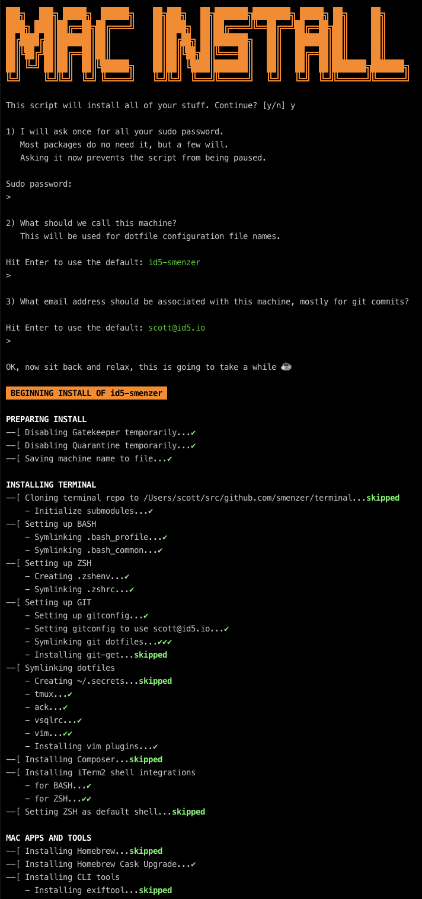

# Install.sh
Everything needed to set up a new machine...Mac or a server

## Usage
_Before installing, ensure the machine has an ssh public key already created and that key is stored in **GitHub** and that git is installed on the machine_

Open up a terminal and execute the following line:
```shell
zsh <(curl -SsL https://raw.githubusercontent.com/smenzer/install.sh/master/install.sh?$RANDOM)
```
### Inputs
It will ask you for a few inputs at the beginning of execution
* `sudo` password: this is to avoid asking during the installation for any items that require it
* the machine name: this will be used for zsh / bash profiles, git configuration templates, etc. that will live in the [terminal](https://github.com/smenzer/terminal) repo
* your email: this will be used to set the default git commit email address on the machine

### Example Output


## What does install.sh do?

Allows installation of (pretty much) everything required for a new machine. Includes git, bash, zsh, iterm2, vim (with plugins), screen, ack, and tmux settings for terminal setup, and for Mac's it also installs common applications, configurations, fonts, and more.

Everything can be configured by editing the `install.sh` script to meet your changing needs. The core of install.sh is based on [X99's reinstall.sh](https://gitlab.com/X99/reinstall.sh), so take a look there for details on how to tweak things to your own liking.

## Credits
Inspired by [X99's reinstall.sh](https://gitlab.com/X99/reinstall.sh) project

## Licence
  

This work is licensed under a [Creative Commons Attribution-ShareAlike 4.0 International License](http://creativecommons.org/licenses/by-sa/4.0/).
